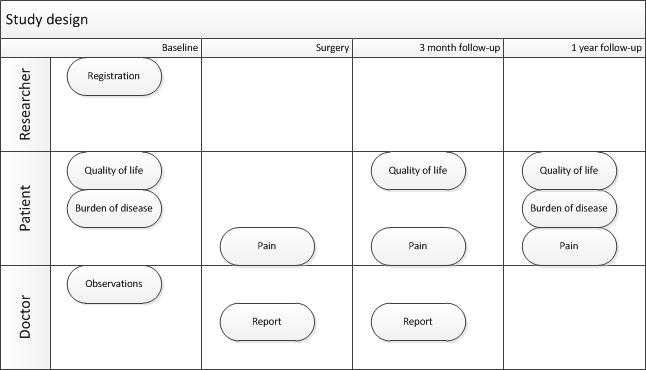

# Introduction
## Core concepts
GemsTracker was developed to improve research in healthcare. It allowes anonymous access for researchers to collected data while still allowing a doctor to see the the individual patient's responses and provide feedback to the patient if needed. Strong points are the scheduling of measurements for individuals, and keeping track of the overall status. It is sometimes referred to as the system taking care of the logistical challenges in research.

To get a headstart developing your own measurement track it is advised to read at least about the names we use to address core concepts.

### Track
A track is the blueprint for the measurement path. It contains all the measurements for each respondent grouped around certain moments in time. Given one or more dates the follow-up moments can be calculated so scheduling can take place. For a study this translates to baseline and followup moments with data collection by study subject, researcher and possibly others. In healthcare this could be pre and post-operation moments with data collection by patient, doctor, nurse and other people.

The general idea behind GemsTracker is that the study subjects or patients can only enter data while others get access to see the data at the individual level (for the doctor) or at anomymous level (for a researcher). Since GemsTracker is really flexible it can be configured to allow different levels for each group.
### Survey
A survey or questionnaire is a data collection form. It contains (groups of) questions, and we promote te reuse surveys as much as possible. A survey could be a validated questionnaire like the Hospital Anxiety and Depression Scale (HADS) that is repeated multiple times during the measurement track. 
Sometimes people combine these instruments into one big survey. This seems very handy, especially when coming from a paper-based world where booklets are often sent out by mail.
This is less flexible if you want to add or leave out one survey at a certain follow-up.
### Round group
The round group is the moment in time where multiple measurements take place. It is sometimes referred to as a visit, event of follow-up moment.
### Round
